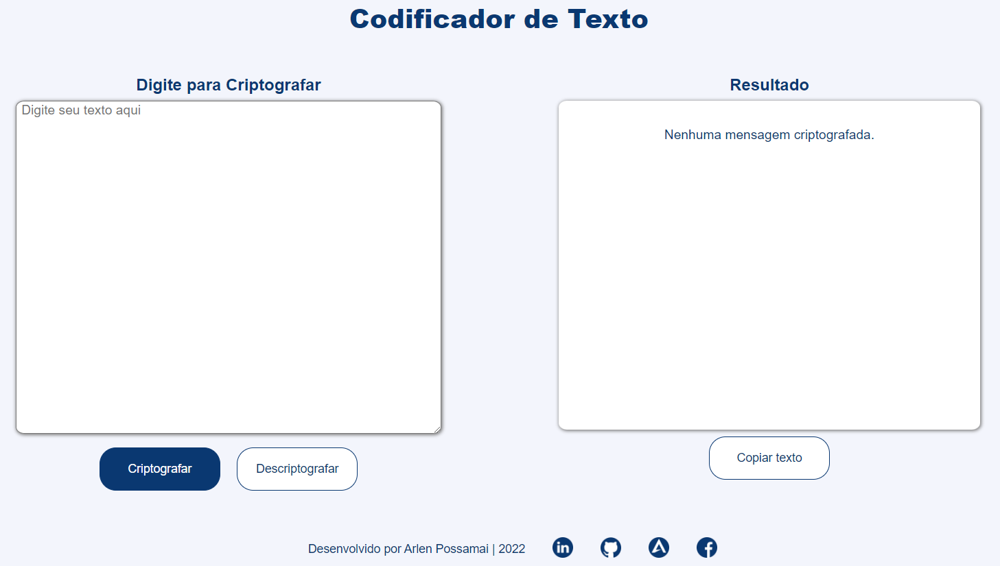

<!-- About the project -->

 
  

  &#xa0;

<h1 align="center">Text Encoder and Decoder</h1>

  
  &nbsp
  
  &nbsp
  
  &nbsp
  
  &nbsp

  <a href="#dart-about">About</a> &#xa0; | &#xa0; 
  <a href="#rocket-technologies">Technologies</a> &#xa0; | &#xa0;
  <a href="#computer-installation">Installation</a> &#xa0; | &#xa0;
  <a href="#memo-license">License</a> &#xa0; | &#xa0;
  <a href="#v-credits">Credits</a> &#xa0; | &#xa0;
  <a href="#pencil2-author">Author</a>

 

## :dart: About ##

This is the first challenge developed during the ONE - Oracle Next Education program, with the aim of putting the contents studied into practice. The challenge is to create a text encoder/decoder using knowledge in HTML, CSS and JavaScript acquired during the classes. Cards were made available in Trello to guide and manage the development of the project and a proposed styling model in Figma.

## :rocket: Technologies ##

- HTML
- CSS
- JavaScript

## :computer: Installation ##

No installation required, you can download the zipped project.

## :memo: License ##

This project is under MIT license. See the [LICENSE](LICENSE) file for more details.

## :v: Credits ##

Partial credits [Lucas Souza](https://github.com/lucasdev3)

## :pencil2: Author ##

  

<a href="#top">Back to top</a>
